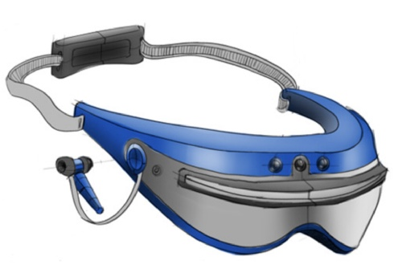
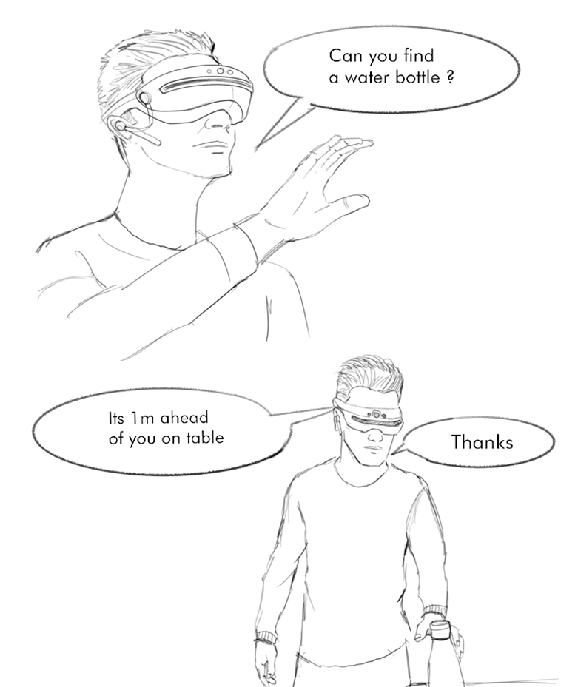

<h1 align="center">
  Cyclops-Visual-Assistant
</h1>

<p align="center">
  
</p>

[](http://hits.dwyl.io//kaustubh-sadekar/Cyclops-Visual-Assistant)


Cyclops is a spatial AI based visual assistant. It is assembled in a device similar to a VR headset and allows the wearer to ask if any objects matching the speech input are found nearby and provides an active feedback when approaching found objects.

**[Link to the demo video](https://www.youtube.com/watch?v=OEDmPRZ-ZPM&feature=youtu.be)**


## Problem Statement
The overall problem statement consists of two main stages.

#### 1. Determining the object to be searched based on the user input.
 
  This can be done using NLP based speech recognition methods. The input is provided in the form of a speech signal by the user, which is converted to a text signal using speech recognition methods. The generated text signal is used to determine the object to be searched.
    
#### 2. Guiding the user to the target object.
    
Object detection can be performed using the OAK-D neural inference functionality. If the object to be searched is detected, audio feedback will be generated, along with additional information about its location with respect to the user. e.g., "Object at 3 meters in the right" or "Object is far away in the left." The approximate distance of the target object will be calculated using the depth functionality of OAK-D. 
    
The audio feedback will be generated continuously based on the updated values from OAK-D until the user reaches the object.    
Finally, the user will be informed when the object is close enough to be held.

Refer the following scenario illustration for better understanding.

<p align="center">
  
</p>

## Requirements

Following python libraries need to be installed

* OpenCV
* depthai
* json
* speech_recognition

## Usage

The [code]("cyclops_code/cyclops.py") can be run after updating the path for audio files and object detection model files. To run the code simply use:

```shell
python3 cyclops.py
```

For object detection pretrained models from [github repository of depthai](https://github.com/luxonis/depthai/blob/master/resources/nn/mobilenet-ssd/mobilenet-ssd.json#L22). The files have also been shared in the mobilenet-ssd folder.


## To Do List

- [ ] **Improve Speech Understanding**

In the present code, the speech to text conversion is very accurate, but the audio is sampled and processed in the background in intervals of 3 seconds. This interaction can be made more efficient and effective.

- [ ] **Improve Audio Feedback Generation**

The present code plays a set of pre-recorded audio files based on different conditions. Methods to generate custom audio files and playing them were explored, but they were very slow and not applicable for real-time operations. In the future, generating custom audio files and running them in real-time can be made faster and more efficient.

- [ ] **Custom Object Registration Pipeline**

Presently the objects Cyclops can detect are limited to the object detection model. In real-life scenarios, some objects are not present in the object detection class list but are essential for the user. A custom object registration pipeline and a training flow can be created to register the object and use Cyclops to search for it in the future.

- [ ] **Text Detection and Recognition**

With a well designed robust pipeline, the functionality of text detection can also be incorporated. So the user can say, "Cyclops read me what you see," to read a book or some signs on the road.

- [ ] **General Environment Update Functionality*

A custom model or the object detection model's predictions can be used to generate a general statement giving a Short summary of the world around the user. NLP based models can be used for more detailed summaries. So the user can ask - "Cyclops, what is going on around me," and custom audio could be generated that provides a summary of the surrounding environment.


